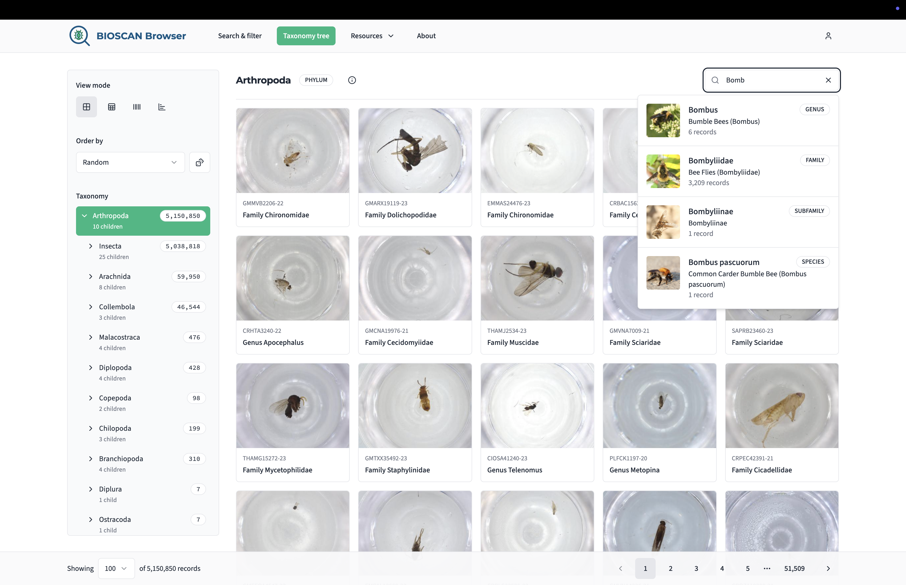
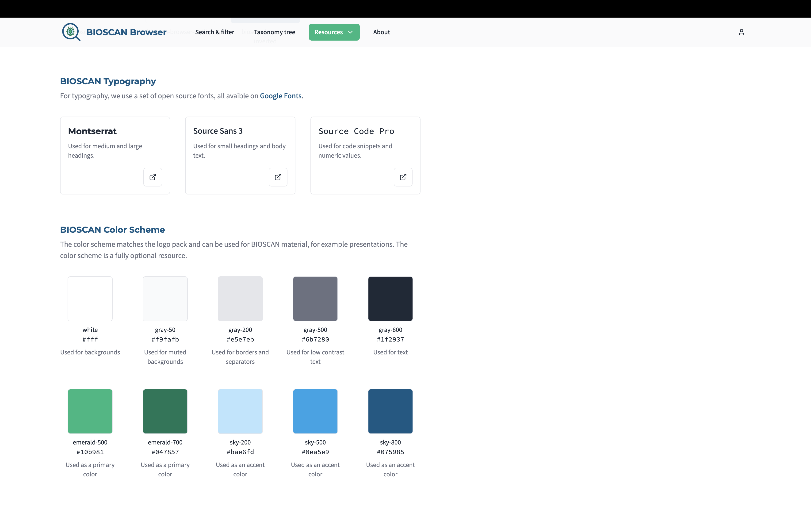

# BIOSCAN Browser

The BIOSCAN Browser is a web interface to navigate the [BIOSCAN-5M dataset](https://github.com/bioscan-ml/BIOSCAN-5M) dataset. The idea is to lower the threshold for users to explore the dataset by presenting data in interactive and comprehensive ways.

Visit the app on https://browser.bioscan-ml.org/!



## Tech stack

- **Frontend**: [React](https://react.dev/) + [TypeScript](https://www.typescriptlang.org/)
- **Build**: [Vite](https://vitejs.dev/)
- **Styling**: [Tailwind CSS](https://tailwindcss.com/)
- **UI primitives**: [Radix](https://www.radix-ui.com/primitives) + [shadcn/ui](https://ui.shadcn.com/)
- **State management and data fetching**: [TanStack Query](https://tanstack.com/query/latest)
- **Package manager**: [NPM](https://www.npmjs.com/)
- **Code quality**: [ESLint](https://eslint.org/) + [Prettier](https://prettier.io/)
- **Deployment**: [Netlify](https://www.netlify.com/)

## Code structure

```
src/
├── components/       # Reusable components
│   └── ui/           # UI primitives
├── pages/            # Page-level components
│   ├── home/
│   ├── search/
│   ├── record/
│   ├── my-bookmarks/
│   ├── find-similar/
│   ├── taxonomy-tree/
│   ├── report/
│   ├── about/
│   └── style-guide/
├── hooks/            # Hooks for data fetching and state management
├── lib/              # Utility functions and helpers
├── types/            # Shared type definitions
├── App.tsx           # Root component
├── main.tsx          # App entry point
└── index.css         # Global styles
```

## Development

### System requirements

- [Node](https://nodejs.org/)
- [NPM](https://www.npmjs.com/)

The `.nvmrc` file in the project root specifies the recommended Node version. If you use [nvm](https://github.com/nvm-sh/nvm), run `nvm use` to switch to the recommended version.

### Getting started

```bash
# Install dependencies
npm install

# Run app in development mode
npm run dev
```

The app will now be available in a browser on http://localhost:5173/. Hot reload will be enabled by default.

### Build for production

```bash
# Build optimized production bundle
npm run build

# Preview production build locally
npm run preview
```

## Code style

We use [Prettier](https://prettier.io/) as a code formatter. The project preferences are specified in `.prettierrc`.

```bash
# Auto format all code
npm run format
```

We use [ESLint](https://eslint.org/) to detect what we consider as problems in the code. The project preferences are specified in `.eslintrc.cjs`.

```bash
# Run linter for all code
npm run lint
```

If you are using Visual Studio Code, the following extensions are recommended for code style:

- [Prettier - Code formatter](https://marketplace.visualstudio.com/items?itemName=esbenp.prettier-vscode)
- [ESLint](https://marketplace.visualstudio.com/items?itemName=dbaeumer.vscode-eslint)

## Style guide

The [style guide](https://browser.bioscan-ml.org/style-guide) is an optional resource that can be used for BIOSCAN material, not only the BIOSCAN Browser. It includes references to logos, fonts and colors.



## UI components

We use [shadcn/ui](https://ui.shadcn.com/) as a component reference. Components are built using [Radix UI](https://www.radix-ui.com/) and [Tailwind CSS](https://tailwindcss.com/).

To add a new component to the project, first check out the list of [available components](https://ui.shadcn.com/docs/components). Then use the CLI to add a component to the project. This will create a new component in folder `/src/components/ui` and install any dependencies it might have. Since components are copied to the project, not installed as dependencies, they can be tweaked as needed.

## Deployment

We use [Netlify](https://www.netlify.com/) for deployment. Changes pushed to the main branch are automatically deployed. When a pull request is opened, a preview version of the changes will be deployed. The URL to the preview deploy will be visible as a PR comment.

## Funders

All project funders are listed on the [about page](https://browser.bioscan-ml.org/about).

## Copyright and licence

The BIOSCAN Browser code is licensed under [MIT](./LICENSE). For dataset copyright and licence information, see the [BIOSCAN-5M repository](https://github.com/bioscan-ml/BIOSCAN-5M).
